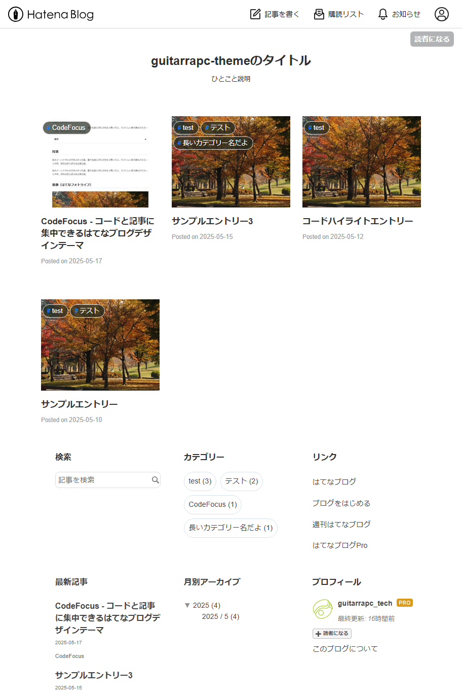
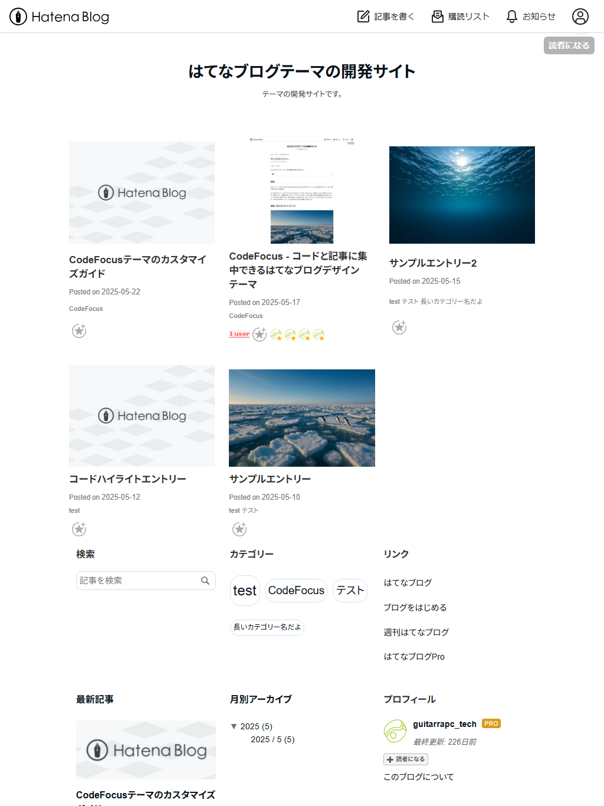

はてなブログをもっとシンプルに、もっと読みやすく。CodeFocusテーマは、[Zenn](https://zenn.dev/)スタイルからインスピレーションを得た、プログラミングブログに最適なシングルカラムデザインのはてなブログテーマです。

[:contents]

## テーマの特徴

CodeFocusテーマは、以下の特徴を持つ現代的なデザインテーマです：

- **シンプルなシングルカラムレイアウト** - コンテンツに集中できる余白と配置を重視したデザイン
- **美しいコードハイライト** - プログラミング記事に最適な読みやすいコード表示
- **便利な目次機能** - 記事内の目次とフローティング目次の両方をサポート
- **完全レスポンシブデザイン** - PC、タブレット、スマートフォンすべてで最適表示
- **タグクラウドスタイル** - カテゴリーを記事数に応じて視覚的に分類
- **Zenn風コメントデザイン** - スッキリと読みやすいディスカッション表示

CodeFocusテーマは、プログラミングブログに最適化されていますが、一般的なブログ用途にも十分対応します。

特に以下のような方におすすめです：

- プログラミングや技術系の記事を書く方
- 読みやすさとシンプルさを重視する方
- コードブロックを多用する方
- 長い記事を書くことが多く、目次機能が欲しい方
- モダンでクリーンなデザインを好む方

## デザインと見た目

CodeFocusテーマは、すべてのデバイスで適切に表示されるよう設計されています。

CodeFocusテーマは複数のデバイスサイズに最適化されており、それぞれのデバイスで読みやすく美しい表示を実現しています。

### デバイス別の記事表示

各デバイスでの表示の違いを以下に示します。PC[^1]では十分な余白を持ったレイアウト、タブレット[^2]ではタッチ操作に適したサイズ調整、スマートフォン[^3]では限られた画面サイズを最大限に活用するレイアウトになっています。

PCでは、コンテンツを中心に配置し、サイドバーが下部に移動することで、記事本文に集中できる環境を提供します。タブレットとスマートフォンでは、デバイスの特性に合わせて余白やフォントサイズが自動調整され、それぞれのデバイスに最適化された読みやすさを実現しています。

記事部分の横幅は3段階で変わります。横幅1200px以上の大きな画面では記事は850pxで表示され、PCや大きなタブレットで快適に読めるようになっています。横幅768pxから1200pxの中程度の画面では記事は790pxで表示され、タブレットや小型ノートPCでも読みやすいサイズです。横幅768px未満のスマートフォンでは記事は100%で表示され、狭い画面でも快適に閲覧できます。いずれもパディングを適切に設定し、コンテンツが画面端に密着しないように配慮されています。

| PC表示 | タブレット表示 | スマートフォン表示 |
| --- | --- | --- |
| [f:id:guitarrapc_tech:20250525112721p:plain:alt=PC表示] | [f:id:guitarrapc_tech:20250525111414p:plain:alt=タブレット表示] | [f:id:guitarrapc_tech:20250525111437p:plain:alt=スマートフォン表示] |

<!-- | screenshots/pc-article-top.png | screenshots/tablet-article-top.png | screenshots/smartphone-article-top.png | -->

## コードブロックとタグクラウド

CodeFocusテーマはプログラミング記事に最適なスタイルを提供します。

### コードハイライト

プログラミング言語のコードブロックを見やすく表示します。色彩がはっきりしており、長いコードでも読みやすいデザインです。

以下は、Python、C#、Goで同一処理を記述したコードの表示例です：

Python

```python
#!/usr/bin/env python3
from dataclasses import dataclass
from typing import List

# 2-D immutable point
@dataclass(frozen=True)
class Point:
    x: float; y: float
    def __add__(self, o: "Point") -> "Point":
        return Point(self.x + o.x, self.y + o.y)

def sum_points(ps: List[Point]) -> Point:
    total = Point(0, 0)
    for p in ps:
        total += p
    return total

if __name__ == "__main__":
    pts = [Point(i, (i * i) % 5) for i in range(5)]
    print(sum_points(pts))
```

C#

```cs
using System;
using System.Collections.Generic;
using System.Linq;

var points = Enumerable.Range(0, 5)
    .Select(i => new Point(i, (i * i) % 5));
Console.WriteLine($"Total = {Sum(points)}");

static Point Sum(IEnumerable<Point> pts)
    => pts.Aggregate(new Point(0, 0), (acc, p) => acc + p);

// immutable value object
public readonly record struct Point(double X, double Y)
{
    public static Point operator +(Point a, Point b) => new(a.X + b.X, a.Y + b.Y);
}
```

Go

```go
package main

import "fmt"

// Point is a simple 2-D vector
type Point struct{ X, Y int }

func (p Point) Add(o Point) Point { return Point{p.X + o.X, p.Y + o.Y} }

func Sum(ps []Point) (t Point) {
	for _, p := range ps { t = t.Add(p) }
	return
}

func main() {
	pts := make([]Point, 5)
	for i := range pts { pts[i] = Point{i, (i * i) % 5} }
	fmt.Printf("Total = %+v\n", Sum(pts))
}
```

### コードコピーボタン

※ テーマ導入後、後述するJavaScriptの設定が必要です。

ワンクリックでコードをコピーできるコードコピーボタン機能を搭載しています。コードブロックにマウスオーバーすると、右上にコピーボタンが表示され、クリックするだけでコードを簡単にコピーできます。

[f:id:guitarrapc_tech:20250525113058p:plain:alt=コードブロックにマウスオーバー時のコピーボタン表示] <!-- screenshots/pc-code-block-with-copy-button.png -->

### タグクラウドスタイル

※ テーマ導入後、後述するJavaScriptの設定が必要です。

サイドバーのカテゴリーモジュールは、タグクラウドスタイルになっており記事数に応じて視覚的に表示します。記事数が多いカテゴリーほど大きく表示されるため、ブログの主要テーマが一目でわかります。

タグクラウドは記事数の平方根を元にスケーリングすることで、以下のような10段階のフォントサイズで表現されます：

- **少ない記事数**: 小さめのフォント (85%～100%)
- **中程度の記事数**: 標準サイズ (110%～130%)
- **多い記事数**: 大きめのフォント (140%～170%)

この視覚的な階層によって、読者はブログの主要トピックを瞬時に把握できます。また、各カテゴリーにマウスを合わせると、記事数を含むツールチップが表示されます。

[f:id:guitarrapc_tech:20250526185241p:plain:alt=サイドバーのタグクラウド表示] <!-- screenshots/pc-sidebar-tag-cloud.png -->

### ダークモード

CodeFocusテーマはダークモード機能をサポートしています。

※ テーマ導入後、後述するJavaScriptの設定が必要です。

ダークモードは、ユーザーのシステム設定に応じて自動的に切り替わるほか、手動での切り替えも可能です。

- **システム設定への自動追従**: デフォルトではOSのシステム設定（ライト/ダーク）に合わせて自動的にテーマが切り替わります。
- **手動切り替え**: 画面右上に表示される3つのボタンを使って、ライトモード・ダークモード・システム設定に手動で切り替えることができます。
- **設定の記憶**: 選択したテーマ設定はブラウザのlocalStorageに保存され、次回訪問時も維持されます。

ダークモード機能を有効にすると、画面右上に次の3つのボタンが表示されます：

- **太陽アイコン**: ライトモードに切り替えます。明るい背景と暗いテキストの標準的な表示になります。
- **月アイコン**: ダークモードに切り替えます。暗い背景と明るいテキストで、夜間の閲覧に最適です。
- **モニターアイコン**: システム設定に合わせます。OSのダークモード設定に追従して自動的に切り替わります。

## 便利な目次機能

CodeFocusテーマは、2種類の目次表示方法を提供しています：

※ テーマ導入後、後述するJavaScriptの設定が必要です。

### 1. 記事内目次

記事の`[:contents]`で生成される目次をスタイリングしました。タイトル部分をクリックすることで開閉可能な目次は、長い記事でも読者が迷わずに読み進められるようサポートします。

[f:id:guitarrapc_tech:20250525113157p:plain:alt=記事内目次のスクリーンショット] <!-- screenshots/pc-toc.png -->

### 2. フローティング目次ボタン

記事右上に常に表示される目次ボタンを提供します。ボタンをクリックするといつでも目次を表示できる、長い記事でも迷子になりません。

[f:id:guitarrapc_tech:20250517234703p:plain:alt=フローティング目次ボタンのスクリーンショット] <!-- screenshots/pc-toc-button.png -->

目次スタイルはシンプルでありながらも機能的です。

[f:id:guitarrapc_tech:20250517234722p:plain:alt=フローティング目次コンテンツのスクリーンショット] <!-- screenshots/pc-floating-toc.png -->

フローティング目次には、閲覧体験を向上させる機能が搭載されています：

#### 1. 自動スクロールポジション追従

記事をスクロールすると、現在読んでいるセクションに対応する目次項目が自動でハイライトされます。長い記事でも現在どのセクションを読んでいるか一目でわかります。

[f:id:guitarrapc_tech:20250525113348p:plain:alt=現在のセクションがハイライトされた目次] <!-- screenshots/toc-first-section-scrolled.png -->

#### 2. ワンクリックでページトップへ移動

フローティング目次の上部には「ページトップへ」ボタンを設置しました。長い記事を読み終えた後、このボタンをクリックするだけで、スムーズにページ最上部へ移動できます。

#### 3. インテリジェントな表示制御

フローティング目次ボタンは、以下のような表示制御を行います：

- 記事の冒頭部分（スクロール位置が浅い場合）では表示されず、一定量スクロールした後に表示
- 目次内のリンクをクリックすると自動的に目次が閉じ、記事の該当セクションにスムーズに移動
- 画面外をクリックすると目次が自動的に閉じる

これらの機能により、記事の閲覧に集中しながらも、必要なときにすぐに目次にアクセスできる快適な読書体験を実現しています。

## テーマの導入方法

はてなブログのテーマストア(推奨)か、GitHubから直接ダウンロードして導入できます。

### テーマストアからの導入

1. [テーマストア](https://blog.hatena.ne.jp/-/store/theme/)から、「CodeFocus」を選択
2. 自分のブログにインストール

### GitHubからの導入

※ デザインCSSでカスタマイズしにくいため、はてなブログの仕組み的にGitHubからの導入は推奨しません。

1. [HatenaBlog-Theme](https://github.com/guitarrapc/hatenablog-theme-codefocus) リポジトリから最新版の `style.css` をダウンロード
2. はてなブログの管理画面から「デザイン設定」→「カスタマイズ」→「デザインCSS」にCSSをコピー＆ペースト
3. 「保存」ボタンをクリックしてテーマを適用

## テーマ導入後の設定

### レスポンシブデザイン設定

CodeFocusテーマはレスポンシブデザインに完全対応していますが、正しく表示するには以下の設定が必要です：

1. はてなブログの管理画面から「デザイン設定」→「スマートフォン」に進む
2. 「詳細設定」のセクションで「レスポンシブデザインを適用する」にチェック
3. 変更を保存

[f:id:guitarrapc_tech:20250517234922p:plain:alt=デザイン設定からスマートフォンをレスポンシブデザイン設定のスクリーンショット] <!-- screenshots/smartphone-responsive-design.png -->

### 目次開閉機能を利用する

記事中の目次を開閉する機能を使用するには、以下の設定を行ってください：

1. [customize-toc-toggle.html](https://github.com/guitarrapc/hatenablog-theme-codefocus/blob/main/customize-toc-toggle.html) ファイルの内容をコピー
2. はてなブログの管理画面から「詳細設定」→「`<head>要素にメタデータを追加`」に貼り付け
3. 変更を保存

### 目次ボタン機能を利用する

ページ右上に固定される目次ボタンを使用するには、以下の設定を行ってください：

1. [customize-toc-button.html](https://github.com/guitarrapc/hatenablog-theme-codefocus/blob/main/customize-toc-button.html) ファイルの内容をコピー
2. はてなブログの管理画面から「詳細設定」→「`<head>要素にメタデータを追加`」に貼り付け
3. 変更を保存

### コードコピーボタン機能を利用する

コードブロック右上に表示されるコピーボタンを利用するには、以下の設定を行ってください：

1. [customize-code-copy.html](https://github.com/guitarrapc/hatenablog-theme-codefocus/blob/main/customize-code-copy.html) ファイルの内容をコピー
2. はてなブログの管理画面から「詳細設定」→「`<head>要素にメタデータを追加`」に貼り付け
3. 変更を保存

### タグクラウド機能を利用する

ページ下部のカテゴリーをタグクラウド表示する、以下の設定を行ってください：

1. [customize-tag-cloud.html](https://github.com/guitarrapc/hatenablog-theme-codefocus/blob/main/customize-tag-cloud.html) ファイルの内容をコピー
2. はてなブログの管理画面から「詳細設定」→「`<head>要素にメタデータを追加`」に貼り付け
3. 変更を保存

### はてなブログPro契約者向け設定

はてなブログProをご利用の方は、トップページを一覧形式に設定することで、多くの記事を一度に見やすいアーカイブ表示を活用できます。いくつかの記事を一覧で表示することで、読者は興味のある記事にすぐにアクセスできます。

1. 「設定」→「詳細設定」でヘッダーとフッターを非表示に設定
2. 「デザイン」→「カスタマイズ」→「レイアウト」で「トップページを一覧形式にする」を選択
3. 変更を保存

| PC表示 | タブレット表示 | スマートフォン表示 |
| --- | --- | --- |
|[f:id:guitarrapc_tech:20250518223005p:plain:alt=PC表示の一覧スクリーンショット] | [f:id:guitarrapc_tech:20250518223026p:plain:alt=タブレット表示の一覧スクリーンショット] | [f:id:guitarrapc_tech:20250518223039p:plain:alt=スマートフォン表示の一覧スクリーンショット] |

<!-- |  |  |  | -->

## カスタマイズについて

CodeFocusテーマは、カスタマイズしやすい構造になっています。様々なパーツを自分好みにアレンジすることができます。

カスタマイズの詳細については、別記事「[CodeFocusテーマのカスタマイズガイド](https://codefocus.hatenablog.jp/entry/2025/05/20/221750)」で詳しく解説していますので、ぜひご覧ください。テーマの色やフォント、目次やカテゴリーのスタイル、さらには高度なカスタマイズ方法まで網羅しています。

## コメントセクション

CodeFocusテーマは、コメントセクションもZennのDiscussionスタイルに似たデザインになっています。ユーザー名や日付が見やすく配置され、コメント内容も読みやすくレイアウトされています。

| PC表示 | タブレット表示 | スマートフォン表示 |
| --- | --- | --- |
| [f:id:guitarrapc_tech:20250517235429p:plain:alt=PC表示のコメントセクションのスクリーンショット] | [f:id:guitarrapc_tech:20250517235508p:plain:alt=タブレット表示のコメントセクションのスクリーンショット] | [f:id:guitarrapc_tech:20250517235524p:plain:alt=スマートフォン表示のコメントセクションのスクリーンショット] |

<!-- | screenshots/pc-comment-section.png | screenshots/tablet-comment-section.png | screenshots/smartphone-comment-section.png | -->

## 関連記事の表示

CodeFocusテーマは、関連記事もスタイリッシュにレイアウトされています。サムネイル画像とタイトル、日付が見やすく配置されており、読者が関連コンテンツを探しやすくなっています。

[f:id:guitarrapc_tech:20250518223136p:plain:alt=関連記事表示のスクリーンショット] <!-- screenshots/pc-related-entries.png -->

## 開発者向け情報

テーマをさらにカスタマイズしたい開発者の方々へ、CodeFocusテーマは以下のような構造でSCSSファイルが分割されています：

- `_code_copy.scss` - コードコピーボタンのスタイル
- `_core.scss` - 全体のベーススタイル
- `_functions.scss` - SCSSで使用する関数定義
- `_related_entries.scss` - 関連記事のスタイル
- `_table_of_contents.scss` - 記事内目次のスタイル
- `_table_of_contents_toggle.scss` - 目次開閉機能のスタイル
- `_table_of_contents_button.scss` - 目次ボタンのスタイル
- `_variable.scss` - カラーやフォントなどの変数定義

この構造により、特定の部分だけを変更したい場合も簡単に対応できます。

### ローカル開発環境の構築

開発環境を構築することで、リアルタイムで変更を確認しながらテーマをカスタマイズできます：

```bash
# リポジトリのクローン
git clone https://github.com/guitarrapc/hatenablog-theme-codefocus.git
cd HatenaBlog-Theme

# 必要なモジュールをインストール
npm install

# 開発サーバーの起動（ブロ���ドメイン名を指定）
npm start -- your-blog.hatenablog.com
```

ブログ記事で開発サーバーのスタイルを参照させるため、はてなブログ → 詳細設定 → `<head>要素にメタデータを追加` に以下を追加してください：

```html
<script type="module" src="http://localhost:5173/@vite/client" crossorigin="anonymous"></script>
<link rel="stylesheet" type="text/css" href="http://localhost:5173/scss/style.scss" crossorigin="anonymous" />
```

これにより、SCSSの変更がリアルタイムでブログに反映され、即座に効果を確認できます。

---

*CodeFocusテーマに関するフィードバックやご質問は、[GitHub Issues](https://github.com/guitarrapc/hatenablog-theme-codefocus/issues)にてお待ちしております。*

[^1]: 大き目ラップトップ想定 1440x1440
[^2]: iPad Pro 12.9想定 1024x1366
[^3]: iPhone 14 Pro Max想定 430x932
